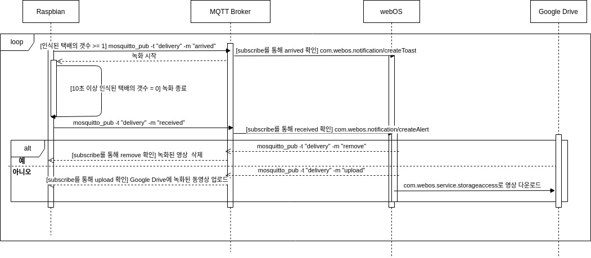

# 배달 도난 방지 기능
## 기능 설명
현관 앞에 설치된 카메라를 이용해 택배 상자 또는 배달음식이 감지되면 영상 녹화를 시작한다. 그 이후 택배 상자 또는 배달음식이 인식 범위에서 사라지면 녹화를 종료하고 월패드로 “구성원이 배송품을 수령하셨습니까?” 문구와 함께 ‘예/아니오’ 버튼을 선택할 수 있는 alert 알림을 띄운다. ‘예’를 선택했다면 녹화된 영상을 삭제하고, ‘아니오’를 선택했다면 녹화된 영상을 Google Drive에 저장해서 월패드에서 사용자가 조회할 수 있도록 한다. 

## 진행 상황

- [ ] 택배 상자 & 배달 음식 감지
- [X] 영상 녹화 
- [X] Google Drive 업로드
- [ ] com.webos.service.storageaccess를 통한 영상 다운로드(webOS에)
- [ ] webOS 서비스 개발(com.webos.notification/createAlert)
---
- [ ] 최종 구현(연계)

## 구성도

